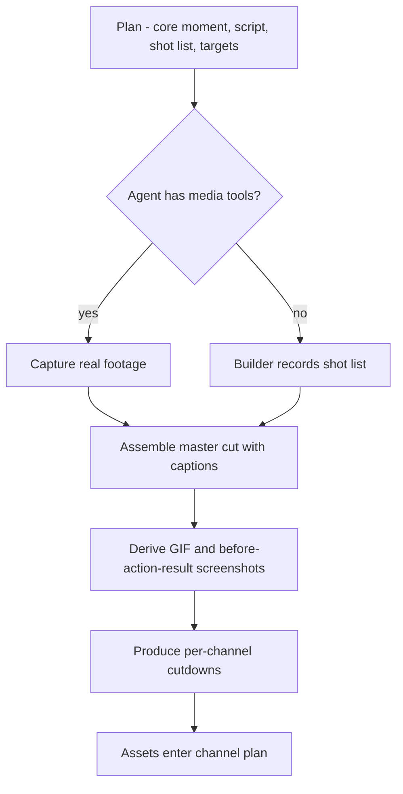
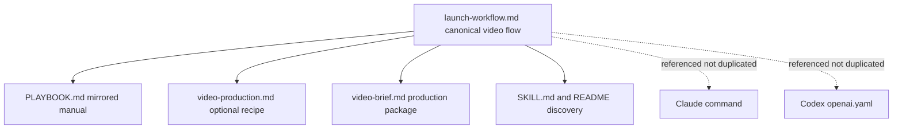

# feat: Add product launch video creation flow

## Summary

Add a "create the launch video" flow to the playbook where the launch agent scripts the demo, captures real product footage, and edits it into the full proof-visual family - a 30–90s master cut, a GIF, before/action/result screenshots, and per-channel cutdowns. The flow's behavior lives in the portable source-of-truth workflow and is mirrored into the human manual; an optional worked recipe and a new fill-in template support it. The contract is a capability-agnostic production package that degrades to a builder-records fallback, so it runs on any markdown agent.

---

## Problem Frame

The playbook already requires a demo video as launch proof (`PLAYBOOK.md` Phase 3) and reduces it to one timeline step, "Record the demo" (Day -9 to -7), but gives no method to produce it - no script, shot list, capture guidance, or editing process. Solo agentic builders, the least likely to have video skills and the most time-pressed at launch, end up skipping the video or shipping a weak one. This plan turns the mandatory-but-unmethodized asset into a runnable flow without breaking the repo's single-source-of-truth portability rule (`docs/solutions/architecture-patterns/portable-workflow-single-source-of-truth.md`).

---

## Requirements

Carried from the origin brainstorm (`docs/brainstorms/2026-06-17-product-launch-video-creation-flow-requirements.md`); IDs match.

**Flow scope**

- R1. A dedicated launch-video creation flow takes the builder from "need a demo video" to finished assets, not a checklist item.
- R2. The agent performs capture and editing, with a manual builder-records fallback.
- R3. One scripted capture produces the demo video, a GIF, and 3–5 before/action/result screenshots.
- R4. Per-channel cutdowns are bounded to the channels the playbook already covers.

**Portability**

- R5. The source-of-truth deliverable is a capability-agnostic production package (core moment, script, shot list, capture moments, per-channel length and aspect-ratio targets, caption text) producible by any markdown agent.
- R6. The flow degrades gracefully: an optional reference toolchain as one worked example, a builder-records fallback, no single toolchain as the contract.
- R7. The flow's behavior lives in the portable workflow and is mirrored into the human manual; platform wrappers reference it, not duplicate it.

**Integrity**

- R8. The flow requires real product footage, prohibits fabricated results, does not hide real latency or failures, and discloses any time-compression.

**Integration with the existing playbook**

- R9. The prep timeline is restructured so video creation is a time-boxed block sized for capture, edit, and cutdowns, replacing the single "Record the demo" step.
- R10. The launch-brief's demo section captures the production-package inputs and asset status.
- R11. A reusable template holds the video production brief, following the existing template style.

---

## Key Technical Decisions

- **Behavior in the workflow; everything else derives.** The canonical flow goes in `skills/launch-project/references/launch-workflow.md`. `PLAYBOOK.md` mirrors it for humans, templates capture its outputs, and wrappers reference it. This is the repo's existing parity rule - behavior that lands only in an adapter silently degrades non-canonical agents (`docs/solutions/architecture-patterns/portable-workflow-single-source-of-truth.md`).
- **Optional recipe lives in its own reference file.** The worked capture/edit/cutdown recipe goes in a new `skills/launch-project/references/video-production.md`, which the workflow points to - mirroring how `copy-templates.md` already sits beside the workflow. Keeps the canonical flow lean and the recipe clearly non-canonical.
- **The production package is the contract; rendering is capability-gated.** The workflow defines the package any agent can produce. A single gate - "does the agent have media tools?" - routes to agent-capture or a builder-records fallback. Neither rendering path is the contract.
- **Cutdowns bound to the existing channel set.** Per-channel variants map only to the playbook's defined channels (Product Hunt, Show HN, Reddit/community, LinkedIn, X/Twitter, GitHub, newsletter/podcast), preventing an open-ended variant farm.
- **The honesty rule extends to editing.** Edit guidance forbids fabricated results and hidden latency/failures and requires disclosing time-compression, inherited from the existing AI-product gate and anti-patterns.
- **No test harness is introduced.** This is a markdown playbook with no automated tests; per-unit "test scenarios" are review-based acceptance and parity checks, not unit tests.

---

## High-Level Technical Design

**Production pipeline with the capability gate** (R2, R3, R4, R6):

**Source-of-truth fan-out** (R7) - the canonical flow feeds every derived surface; wrappers reference rather than copy:

---

## Implementation Units

### U1. Add the launch-video flow to the portable workflow

- **Goal:** Add the canonical "Create The Launch Video" step to the source-of-truth workflow: the four-step flow, the production-package contract, the capability gate plus builder-records fallback, the honesty rule, an Expected Outputs entry for the new template, and a pointer to the optional recipe reference.
- **Requirements:** R1, R2, R3, R5, R6, R7, R8
- **Dependencies:** none
- **Files:** `skills/launch-project/references/launch-workflow.md`
- **Approach:** Insert a new step immediately after "3. Build The Proof Pack" (the proof pack lists the assets; this step is the method). Keep it lean: the four-step flow (plan → capture → assemble family → cutdowns), the package fields from R5, the "media tools?" gate with the manual fallback, the honesty constraint, and a one-line pointer to `references/video-production.md` for the optional recipe. Add `templates/video-brief.md` to the "Expected Outputs" mapping. Do not inline the recipe or per-channel specs here.
- **Patterns to follow:** existing numbered workflow steps (short imperative bullets); the step-6 pointer to `copy-templates.md`; the "Expected Outputs" mapping style.
- **Test scenarios:**
  - Covers AE1. A reader with no media tools, reading only this file, can produce the full production package plus a manual shot list - no step requires tooling to produce the package.
  - Covers AE5. The step names no platform-specific tool as required.
  - Covers AE2, AE3 (contract level). The step names the full family (video, GIF, screenshots) and the bounded cutdown set.
  - The "Expected Outputs" section lists `templates/video-brief.md`.
  - Test expectation: documentation - verified by review against the above; no automated tests in repo.
- **Verification:** A tool-less agent reading only `launch-workflow.md` knows what package to produce and what assets and cutdowns are expected; the recipe is referenced, not inlined.

### U2. Add the optional video-production reference

- **Goal:** Create the worked recipe - capture approach, edit/assembly guidance, per-channel cutdown specs, and one named reference toolchain - explicitly marked as an optional, non-canonical example.
- **Requirements:** R4, R6, R8
- **Dependencies:** U1
- **Files:** `skills/launch-project/references/video-production.md`
- **Approach:** Mirror the role `copy-templates.md` plays beside the workflow. Open with a banner: this is one worked example, not the contract; the contract is the production package in the workflow. Include a per-channel cutdown table (channel → target length → aspect ratio) covering exactly the playbook's channels. Name one reference toolchain (e.g., a browser/computer-use capture path plus an `ffmpeg` assembly path) as illustration only. Include a capture/edit checklist and restate the honesty reminders.
- **Patterns to follow:** `copy-templates.md` sectioned-reference structure and placeholder style.
- **Test scenarios:**
  - Covers AE3. The cutdown table lists exactly the playbook's channels, each with a length and aspect target; no channel outside the set.
  - Covers AE4. Edit guidance states the honesty rule (real footage, disclose time-compression, no fabricated results).
  - The doc declares itself optional/non-canonical in its opening.
  - Test expectation: documentation - verified by review.
- **Verification:** An agent with media tools can follow the recipe to render assets; an agent that ignores it still succeeds via the workflow contract alone.

### U3. Mirror the flow into the human manual and restructure the timeline

- **Goal:** Add a "Create The Launch Video" subsection to `PLAYBOOK.md` describing the same flow for humans, and restructure the Phase 7 timeline so video is a sized, time-boxed block replacing the single "Record the demo" step.
- **Requirements:** R1, R7, R9
- **Dependencies:** U1
- **Files:** `PLAYBOOK.md`
- **Approach:** Mirror the workflow flow in human-manual voice under (or right after) Phase 3 "Build The Proof Pack" - parity only, no behavioral step present here but absent from the workflow. In the Phase 7 timeline, replace the "Record the demo" line: put "plan + capture the launch video" in Day -9 to -7 and "assemble cut, GIF, screenshots, and channel cutdowns" in Day -6 to -4 alongside copy work.
- **Patterns to follow:** existing `PLAYBOOK.md` phase prose and the Day-range timeline structure.
- **Test scenarios:**
  - Covers AE5. The manual's video subsection and `launch-workflow.md` describe the same flow with no behavioral step in one but missing from the other.
  - The timeline no longer contains a bare "Record the demo" step; video work spans a capture block and an edit/cutdown block.
  - Test expectation: documentation - verified by diffing the manual against the workflow for parity.
- **Verification:** A human reading `PLAYBOOK.md` alone can run the flow; the timeline allocates realistic time for capture plus edit plus cutdowns.

### U4. Add the production-brief template and expand the launch-brief demo section

- **Goal:** Create `templates/video-brief.md` as the fill-in production package, and expand the demo section of `templates/launch-brief.md` to capture production inputs and asset status with a pointer to the video brief.
- **Requirements:** R3, R5, R10, R11
- **Dependencies:** U1
- **Files:** `templates/video-brief.md`, `templates/launch-brief.md`
- **Approach:** `video-brief.md` sections mirror the package fields named in U1 so the template *is* the package: core moment; one-line video story; script/voiceover; caption text; shot list with capture moments; target lengths; per-channel cutdown checklist with length and aspect-ratio targets; asset status (video / GIF / screenshots / cutdowns). In `launch-brief.md`, expand the single "Demo asset:" line into a short block (core moment, script status, shot-list status, cutdown status) linking to `templates/video-brief.md`. Keep it fillable in one sitting - mark optional fields optional (the templates-too-heavy risk).
- **Patterns to follow:** `launch-brief.md` field style and placeholder conventions.
- **Test scenarios:**
  - Every production-package field in the `launch-workflow.md` contract appears in `video-brief.md` (no contract field missing).
  - Covers AE3. The cutdown checklist enumerates the playbook's channels.
  - The launch-brief demo section references `templates/video-brief.md` and is no longer a single bare line.
  - Test expectation: documentation - verified by review against the contract.
- **Verification:** A builder can fill `video-brief.md` in one sitting and hand it to an agent as the production package.

### U5. Parity and discoverability sweep

- **Goal:** Surface the new assets and reference across discovery surfaces and confirm wrappers stay thin.
- **Requirements:** R7
- **Dependencies:** U1, U2, U3, U4
- **Files:** `skills/launch-project/SKILL.md`, `README.md`, `.claude/commands/launch-project.md` (verify), `skills/launch-project/agents/openai.yaml` (verify)
- **Approach:** Add the video assets to `SKILL.md` "Expected Outputs" and add a "read `references/video-production.md` when producing the launch video" pointer beside the existing `copy-templates.md` pointer. In `README.md`, list `templates/video-brief.md` under Start Here / Agent Use, and add this brainstorm and plan to the existing "Source Artifacts" section (which already lists the prior brainstorm and plan). Confirm both wrappers reference the workflow and carry no video-flow prose; if either duplicates flow behavior, fix toward reference-only.
- **Patterns to follow:** `SKILL.md` "Source Of Truth" / "Expected Outputs"; `README.md` section structure; the wrapper-reference rule from `docs/solutions/architecture-patterns/portable-workflow-single-source-of-truth.md`.
- **Test scenarios:**
  - Covers AE5. Neither wrapper contains video-flow behavior absent from the workflow.
  - `SKILL.md` "Expected Outputs" and `README.md` list the new template and reference.
  - Test expectation: documentation - verified by review and a grep for duplicated flow phrases across wrappers.
- **Verification:** A user discovering the skill via `README.md` or `SKILL.md` finds the video flow and its template; wrappers remain thin.

---

## Scope Boundaries

**Deferred for later** (from origin):

- Thumbnails, subtitle/caption localization, and music or licensing guidance.
- Long-form formats (full demo walkthroughs, webinar or launch-stream content).

**Outside this product's identity** (from origin):

- AI-generated or synthetic video (text-to-video, avatar voiceover) - conflicts with showing the real product working.
- Distributing or posting the video - stays with the existing channel-copy and launch-day flows; this flow only produces assets.
- Shipping a video editor, renderer, or hosted service as repo software - the playbook is portable markdown guidance.

**Deferred to follow-up work** (plan-local):

- Resolving the pre-existing copy duplication between `references/copy-templates.md` and `templates/channel-copy.md` flagged in `docs/solutions/architecture-patterns/portable-workflow-single-source-of-truth.md` - out of scope here; do not let the video reference/template repeat that pattern.

---

## Risks & Dependencies

| Risk | Mitigation |
| --- | --- |
| Video behavior drifts into a wrapper or the manual diverges from the workflow. | Keep behavior in `launch-workflow.md`; U3 and U5 verify parity by diffing against it. |
| The new reference/template repeats the known copy-duplication drift. | Reference doc points back to the workflow contract instead of restating it; template captures fields, not prose. |
| Channel cutdown specs (length, aspect, sound) go stale. | Frame them as current-rule items to verify before a real launch, consistent with the existing current-rule check. |
| Templates become too heavy for solo builders. | Keep `video-brief.md` fillable in one sitting; mark optional fields optional. |

---

## Sources & Research

- Origin requirements: `docs/brainstorms/2026-06-17-product-launch-video-creation-flow-requirements.md`.
- Parity / portability constraint: `docs/solutions/architecture-patterns/portable-workflow-single-source-of-truth.md`, `AGENTS.md`.
- Surfaces touched: `skills/launch-project/references/launch-workflow.md` (Build The Proof Pack, Expected Outputs), `PLAYBOOK.md` (Phase 3, Phase 7 timeline), `templates/launch-brief.md` (Demo asset), `skills/launch-project/SKILL.md`, `README.md`.
